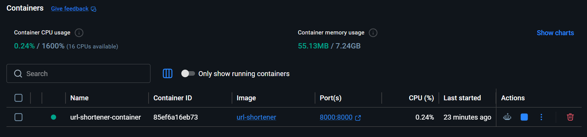

# URL Shortener API

A production-style URL Shortener API built using FastAPI, SQLAlchemy, SQLite, Docker, and Pydantic.

This project allows users to create short URLs, manage custom short codes, track clicks, monitor URL status, search URLs, and automatically handle URL expiration. The application is fully containerized using Docker and includes interactive API documentation through Swagger UI.

---

## Features

* Create short URLs from long URLs
* Generate random unique short codes
* Create custom short codes
* Automatic URL redirection
* Click tracking and analytics
* URL expiration support
* URL expiration validation
* Automatic expiration checking during redirects
* URL status tracking (Active / Expired)
* Search URLs by keyword
* Update existing short codes
* Delete URLs
* Pagination support
* Interactive Swagger UI documentation
* SQLite database persistence
* Request and response validation using Pydantic
* Docker containerization

---

## API Endpoints

| Method | Endpoint               | Description               |
| ------ | ---------------------- | ------------------------- |
| GET    | `/`                    | API Home                  |
| POST   | `/shorten`             | Create a short URL        |
| GET    | `/urls`                | List all URLs (paginated) |
| GET    | `/stats/{short_code}`  | Get URL statistics        |
| GET    | `/search/{keyword}`    | Search URLs               |
| PUT    | `/update/{short_code}` | Update short code         |
| DELETE | `/delete/{short_code}` | Delete URL                |
| GET    | `/{short_code}`        | Redirect to original URL  |

---

## Tech Stack

* Python 3.8+
* FastAPI
* SQLAlchemy
* SQLite
* Pydantic
* Uvicorn
* Docker

---

## API Highlights

* RESTful API design
* Interactive Swagger and ReDoc documentation
* Automatic request validation
* Pagination support
* URL expiration management
* Click analytics
* Custom short code support
* SQLite persistence using SQLAlchemy ORM
* Dockerized deployment

---

## Project Structure

```text
url-shortener/
│
├── app/
│   ├── main.py
│   ├── database.py
│   ├── models.py
│   └── schemas.py
│
├── images/
│   ├── swagger.png
│   └── docker-running.png
│
├── Dockerfile
├── .dockerignore
├── requirements.txt
├── README.md
└── .gitignore
```

---

## Installation

Clone the repository:

```bash
git clone https://github.com/Sangeeth-dev-codes/url-shortener.git
```

Navigate to the project directory:

```bash
cd url-shortener
```

Create a virtual environment:

```bash
python -m venv myenv
```

Activate the virtual environment:

### Windows

```bash
myenv\Scripts\activate
```

### Linux / macOS

```bash
source myenv/bin/activate
```

Install dependencies:

```bash
pip install -r requirements.txt
```

---

## Run the Application

Start the FastAPI server:

```bash
uvicorn app.main:app --reload
```

Application URL:

```text
http://127.0.0.1:8000
```

Swagger Documentation:

```text
http://127.0.0.1:8000/docs
```

ReDoc Documentation:

```text
http://127.0.0.1:8000/redoc
```

---

## Docker Setup

Build the Docker image:

```bash
docker build -t url-shortener .
```

Run the Docker container:

```bash
docker run -d -p 8000:8000 --name url-shortener-container url-shortener
```

Verify the running container:

```bash
docker ps
```

View container logs:

```bash
docker logs url-shortener-container
```

Access the application:

```text
http://127.0.0.1:8000
```

Swagger Documentation:

```text
http://127.0.0.1:8000/docs
```

---

## Docker Deployment

The application is fully containerized using Docker.

### Running Container



---

## Swagger Documentation Preview


---

## Example Usage

### Create Short URL

Request:

```json
{
  "url": "https://openai.com",
  "custom_code": "openai",
  "expires_in_days": 30
}
```

Response:

```json
{
  "original_url": "https://openai.com/",
  "short_code": "openai",
  "short_url": "http://127.0.0.1:8000/openai",
  "expires_at": "2026-07-08T09:33:34.056615"
}
```

---

### Get URL Statistics

Request:

```http
GET /stats/openai
```

Response:

```json
{
  "original_url": "https://openai.com/",
  "short_code": "openai",
  "clicks": 5,
  "created_at": "2026-06-08T09:33:34.062732",
  "expires_at": "2026-07-08T09:33:34.056615",
  "status": "active"
}
```

---

### Search URLs

Request:

```http
GET /search/open
```

Response:

```json
[
  {
    "id": 1,
    "original_url": "https://openai.com/",
    "short_code": "openai"
  }
]
```

---

### List URLs

Request:

```http
GET /urls?limit=10&offset=0
```

Response:

```json
[
  {
    "id": 1,
    "original_url": "https://openai.com/",
    "short_code": "openai",
    "clicks": 3,
    "created_at": "2026-06-08T09:33:34.062732",
    "expires_at": "2026-07-08T09:33:34.056615"
  }
]
```

---

## URL Expiration

Each shortened URL can have an expiration period.

When an expired URL is accessed:

```json
{
  "detail": "This URL has expired"
}
```

HTTP Status:

```text
410 Gone
```

---

## Validation Rules

### URL Creation

* URL must be valid.
* Custom short code must be unique.
* `expires_in_days` must be greater than or equal to 1.

Example validation error:

```json
{
  "detail": [
    {
      "type": "greater_than_equal",
      "loc": ["body", "expires_in_days"],
      "msg": "Input should be greater than or equal to 1"
    }
  ]
}
```

---

## Future Enhancements

* User authentication and authorization
* QR code generation
* Analytics dashboard
* PostgreSQL support
* Redis caching
* Kubernetes deployment
* Custom expiration dates and time-based expiry
* Rate limiting
* Admin dashboard

---

## Version

Current Release: **v1.2.0**

### What's New in v1.2.0

* Added URL expiration support
* Added URL status tracking
* Added pagination for URL listing
* Added validation for expiration days
* Added 410 Gone response for expired URLs
* Added Docker containerization
* Added Docker deployment support

---

## Repository

GitHub: https://github.com/Sangeeth-dev-codes/url-shortener

---

## License

This project is provided for learning and educational purposes only.

---

## Author

**Sangeeth C**

Python Developer | FastAPI | SQLAlchemy | Docker | Backend Development

Actively building backend applications and REST APIs using modern Python technologies.
