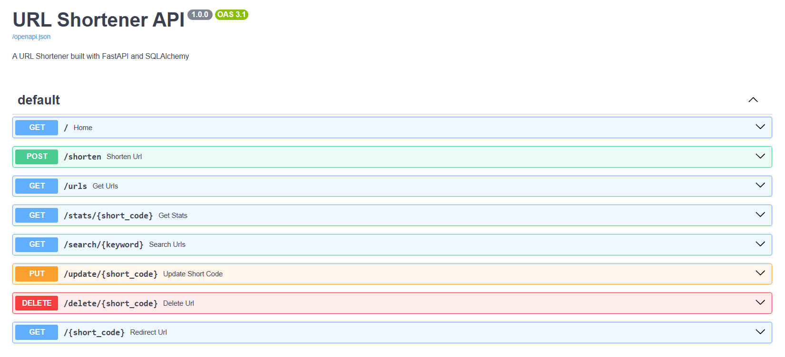

# URL Shortener API

A URL Shortener built using FastAPI, SQLAlchemy, SQLite, and Pydantic.

---

## Features

- Create short URLs
- Generate random short codes
- Create custom short codes
- Redirect using short URLs
- Track click counts
- Search URLs
- Update short codes
- Delete URLs
- View URL statistics
- Interactive Swagger documentation

---

## API Endpoints

| Method | Endpoint | Description |
|---------|----------|-------------|
| GET | `/` | Home |
| POST | `/shorten` | Create short URL |
| GET | `/urls` | List all URLs |
| GET | `/stats/{short_code}` | Get URL statistics |
| GET | `/search/{keyword}` | Search URLs |
| PUT | `/update/{short_code}` | Update short code |
| DELETE | `/delete/{short_code}` | Delete URL |
| GET | `/{short_code}` | Redirect to original URL |

---

## Tech Stack

- Python 3.8
- FastAPI
- SQLAlchemy
- SQLite
- Pydantic
- Uvicorn

---

## Project Structure

```
url-shortener/
│
├── app/
│   ├── main.py
│   ├── database.py
│   ├── models.py
│   └── schemas.py
│
├── requirements.txt
├── README.md
└── .gitignore
```

---

## Installation

Clone the repository:

```bash
git clone https://github.com/Sangeeth-dev-codes/url-shortener.git
```

Move into project directory:

```bash
cd url-shortener
```

Create virtual environment:

```bash
python -m venv myenv
```

Activate virtual environment:

Windows:

```bash
myenv\Scripts\activate
```

Install dependencies:

```bash
pip install -r requirements.txt
```

---

## Run the Application

```bash
uvicorn app.main:app --reload
```

Application:

```text
http://127.0.0.1:8000
```

Swagger Documentation:

```text
http://127.0.0.1:8000/docs
```

---

## Swagger Documentation Preview



---

## Example

Create URL:

```json
{
    "url": "https://openai.com"
}
```

Response:

```json
{
    "original_url": "https://openai.com",
    "short_code": "ABC123",
    "short_url": "http://127.0.0.1:8000/ABC123"
}
```

---

## Future Enhancements

- User authentication
- URL expiration support
- QR code generation
- Analytics dashboard
- PostgreSQL integration
- Docker deployment

---

## Version

Current Release:

v1.0.0

---

## Author

Sangeeth C

Learning Python Backend Development with FastAPI and SQLAlchemy.